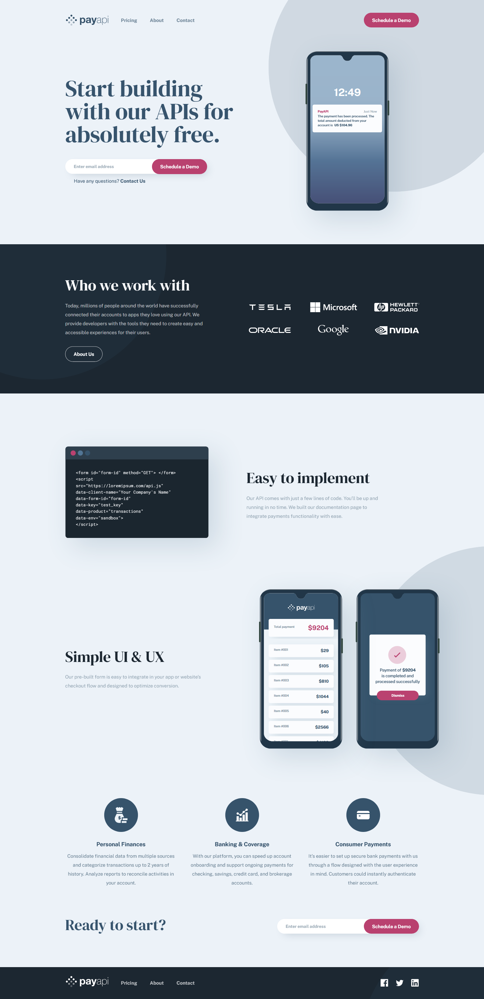

# Frontend Mentor - PayAPI multi-page website solution

This is a solution to the [PayAPI multi-page website challenge on Frontend Mentor](https://www.frontendmentor.io/challenges/payapi-multipage-website-FDLR1Y11e). Frontend Mentor challenges help you improve your coding skills by building realistic projects.

## Table of contents

- [Frontend Mentor - PayAPI multi-page website solution](#frontend-mentor---payapi-multi-page-website-solution)
  - [Table of contents](#table-of-contents)
  - [Overview](#overview)
    - [The challenge](#the-challenge)
    - [Screenshot](#screenshot)
    - [Links](#links)
  - [My process](#my-process)
    - [Built with](#built-with)
    - [What I learned](#what-i-learned)
    - [Useful resources](#useful-resources)
  - [Author](#author)

<!-- **Note: Delete this note and update the table of contents based on what sections you keep.** -->

## Overview

### The challenge

Users should be able to:

- View the optimal layout for each page depending on their device's screen size
- See hover states for all interactive elements throughout the site
- Receive an error message when the contact form is submitted if:
  - The `Name`, `Email Address` or `Message` fields are empty should show "This field can't be empty"
  - The `Email Address` is not formatted correctly should show "Please use a valid email address"

### Screenshot

### Links

- Solution URL: [frontendmentor.io](https://your-solution-url.com)
- Live Site URL: [netlify.com](https://payapi-multi-page-website.netlify.app)

## My process

### Built with

- Semantic HTML5 markup
- CSS custom properties
- Flexbox
- CSS Grid
- Mobile-first workflow
- utility-first classes
- some SVG images
- Sass preprosessor
- Vanilla JavaScript

<!-- **Note: These are just examples. Delete this note and replace the list above with your own choices** -->

### What I learned

<!-- Use this section to recap over some of your major learnings while working through this project. Writing these out and providing code samples of areas you want to highlight is a great way to reinforce your own knowledge. -->

- The big thing I learned is how to properly and responsively position an element as the background image of other element. In this project an image named bg-pattern-circle.svg is used many times as a background of other elements. This image has been positioned differently on different viewport width, so it is hard solve the position problem by just simply writing background-image: url(); and background-position: xx yy; rather I used ::before pseudo element with absolute position.
- This project also taught me use of inline-flex and inline-grid;
- I created a nice sidebar menu with some vanilla js.
- learned a nice trick `max-width: 40rem; width: 100%;`
  is similar to `width: min(40rem, 100%); `
- learned to validate form with optimized vanilla js code
- learned some new solution to layout problem;

### Useful resources

- [Sass boilerplate](https://github.com/abhijitbcob/sass-boilerplate) - Sass boilerplate for fast project start.

## Author

- Frontend Mentor - [@abhijitbcob](https://www.frontendmentor.io/profile/abhijitbcob)
- Twitter - [@Abhijit46752961](https://twitter.com/Abhijit46752961)
